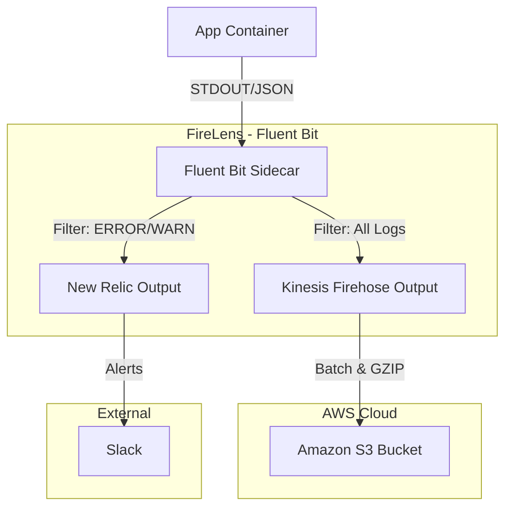

# ECS FireLens PoC Project

## 🎯 Project Overview

**ECS FireLens PoC** - ECSサービスからNew RelicとS3へログを同時配信するアーキテクチャの検証プロジェクト

### Project Goals
- **Observability（可観測性）** と **Compliance/長期保存** の両立
- ログの **構造化（JSON形式）** による分析効率の向上
- **サーバーレス化** による運用保守の最小化
- コスト最適化のための **ログフィルタリング戦略** の検証

---

## 🏗 System Architecture

### Tech Stack
* **Log Router:** Fluent Bit (AWS FireLens) - Image: `public.ecr.aws/aws-observability/aws-for-fluent-bit:stable`
* **Container Platform:** Amazon ECS (Fargate)
* **Log Destinations:**
  - New Relic (リアルタイム監視・アラート)
  - Amazon S3 via Kinesis Data Firehose (長期保存・コンプライアンス)
* **Sample App:** TypeScript (Node.js) - レバテック標準言語として採用
* **Infra:** Terraform (Provider: `hashicorp/aws`)
* **Local Dev:** Docker & Docker Compose

### Architecture Data Flow



### Key Design Decisions

1. **FireLens (Fluent Bit) パターン**
   - ECSの標準機能を使用したサイドカー構成
   - *Trade-off:* タスク定義が複雑になるが、中継用EC2/Kinesisの管理が不要

2. **Kinesis Data Firehose経由のS3配信**
   - Firehoseでバッファリング・GZIP圧縮・パーティショニングを実施
   - *Trade-off:* Firehoseのコストが発生するが、Athenaでのクエリ効率が大幅に向上

3. **ログの出し分け戦略**
   - New Relic: ERROR/WARN + 重要なINFOのみ（コスト削減）
   - S3: 全量保存（コンプライアンス対応）
   - *Trade-off:* フィルタ設定の複雑さ vs Ingestコストの削減

---

## 🔌 Tooling & MCP Capabilities

このプロジェクトでは Model Context Protocol (MCP) サーバーを活用してタスクを自動化する。積極的にこれらのツールを使用すること。

### 🛠 Local Development & Operations
| Server | Capability | Usage Scenario |
| :--- | :--- | :--- |
| **Filesystem** | ファイル I/O | 設定ファイル（`fluent-bit.conf`）の読み書き、テストログの作成、Terraformファイルの管理。 |
| **Terraform** | IaC管理 | HCL構文の検証（`terraform validate`）、コードフォーマット、Docker経由でのplan実行。 |

### ☁️ AWS & Infrastructure
| Server | Capability | Usage Scenario |
| :--- | :--- | :--- |
| **AWS Labs** | AWS API アクセス | 現在のAWSリソース状態の確認（S3バケットの存在確認、IAMロールポリシーの検証など）。リージョン: `ap-northeast-1`。 |
| **AWS Knowledge** | アーキテクチャドキュメント | AWS Well-Architectedパターンや FireLens 固有の制限/クォータを参照。 |

### 🧠 Knowledge & Context
| Server | Capability | Usage Scenario |
| :--- | :--- | :--- |
| **Serena** | プロジェクトコンテキスト | プロジェクト状態の追跡。（注: 即時タスクのコンテキストは `CLAUDE.md` を優先） |

### MCP 使用の優先順位

1. **推測より実行:** 設定が正しいか「推測」するのではなく、`docker-compose` でコンテナを起動してエラー出力を確認する
2. **AWS状態確認:** Terraform を書く前に **AWS Labs MCP** でリソース（Log Groupなど）が既に存在するか確認し、import エラーを回避する

---

## 🛠 Development Workflow & Commands

**Claude Code Note:** Use these commands to verify changes.

### 1. Local Testing (Docker Compose)

* **Start Environment:**
  ```bash
  docker-compose up --build -d
  ```
* **Follow Logs (Fluent Bit):**
  ```bash
  docker-compose logs -f fluent-bit
  ```
* **Generate Test Logs (Sample App):**
  ```bash
  docker-compose exec sample-app /bin/sh -c 'echo "{\"level\":\"ERROR\",\"message\":\"Test error log\"}"'
  ```
* **Clean Up:**
  ```bash
  docker-compose down -v
  ```

### 2. Config Validation

* **Fluent Bit Dry Run:**
  ```bash
  docker run --rm \
    -v $(pwd)/fluent-bit/fluent-bit.conf:/fluent-bit/etc/fluent-bit.conf \
    -v $(pwd)/fluent-bit/parsers.conf:/fluent-bit/etc/parsers.conf \
    public.ecr.aws/aws-observability/aws-for-fluent-bit:stable \
    /fluent-bit/bin/fluent-bit -c /fluent-bit/etc/fluent-bit.conf --dry-run
  ```

### 3. Infrastructure (Terraform)

* **Init & Plan:**
  ```bash
  cd terraform/environments/dev
  terraform init
  terraform plan -var-file="dev.tfvars"
  ```
* **Format & Validate:**
  ```bash
  terraform fmt -recursive
  terraform validate
  ```
* **Apply (with confirmation):**
  ```bash
  terraform apply -var-file="dev.tfvars"
  ```

### 4. AWS Verification

* **Check Firehose Delivery:**
  ```bash
  aws firehose describe-delivery-stream --delivery-stream-name firelens-poc-dev-stream
  ```
* **List S3 Objects:**
  ```bash
  aws s3 ls s3://firelens-poc-dev-logs/ --recursive
  ```

---

## 📁 Project Structure

```
ecs-firelens-poc/
├── CLAUDE.md                    # Project Context (This file)
├── .env.example                 # Template for env vars (Do NOT commit .env)
├── .gitignore                   # Git ignore rules
├── docker-compose.yml           # Local orchestration
├── docs/                        # Documentation
│   ├── architecture.md          # Architecture details
│   ├── cost-estimation.md       # Cost estimation
│   └── runbook.md               # Operations runbook
├── fluent-bit/                  # Fluent Bit Configuration
│   ├── Dockerfile               # Custom image definition
│   ├── fluent-bit.conf          # Main config
│   ├── parsers.conf             # Parser definitions
│   └── filters/                 # Split filter configs
├── terraform/                   # Infrastructure
│   ├── environments/
│   │   ├── dev/                 # Dev environment
│   │   └── prod/                # Prod environment
│   ├── modules/
│   │   ├── ecs/                 # ECS module
│   │   ├── firehose/            # Firehose module
│   │   └── s3/                  # S3 module
│   └── README.md
├── ecs-task-definition/         # ECS task definition reference
│   └── task-definition.json
└── sample-app/                  # Test app for log generation (TypeScript)
    ├── Dockerfile
    ├── package.json
    ├── tsconfig.json
    ├── src/
    │   └── main.ts
    └── README.md
```

---

## 📊 Log Schema

### Standard JSON Format
```json
{
  "timestamp": "2024-01-15T10:30:00.000Z",
  "level": "INFO",
  "service": "my-ecs-service",
  "environment": "production",
  "trace_id": "abc123",
  "span_id": "def456",
  "message": "Request processed successfully",
  "context": {
    "user_id": "user-789",
    "request_path": "/api/v1/resource",
    "response_time_ms": 45
  }
}
```

### Log Level Definition
| Level | Description | New Relic | S3 |
|-------|-------------|-----------|-----|
| ERROR | System errors requiring action | ✅ | ✅ |
| WARN | Warnings, potential issues | ✅ | ✅ |
| INFO | Important business events | ✅ (selective) | ✅ |
| DEBUG | Debug information | ❌ | ✅ |

### Filtering Logic (fluent-bit.conf)

1. **Tag:** `app-firelens*`
2. **Filter 1 (Modify):** Add `environment` and `ecs_task_arn` metadata
3. **Filter 2 (Grep for New Relic):**
   - Keep if `level` matches `ERROR|WARN`
   - OR if `message` contains specific keywords
4. **Output:**
   - **New Relic:** Send filtered logs only
   - **Kinesis Firehose:** Send ALL logs

---

## 🔐 Security Rules

### Critical Rules

1. **Secrets Management:**
   - NEVER commit API Keys, AWS Credentials, or New Relic License Keys
   - Use AWS Secrets Manager for production secrets

2. **Local Development:**
   - Use `.env` file for local secrets (must be in `.gitignore`)
   - Provide `.env.example` as template (without actual values)

3. **Terraform:**
   - Use `terraform.tfvars` for sensitive variables (must be in `.gitignore`)
   - Or use environment variables (`TF_VAR_*`)
   - NEVER commit `*.tfvars` files with secrets

4. **Container Images:**
   - Use official AWS ECR images: `public.ecr.aws/aws-observability/aws-for-fluent-bit:stable`
   - Pin versions in production

### Files to NEVER Commit
```
.env
*.tfvars
terraform.tfstate
terraform.tfstate.backup
*.pem
*credentials*
```

---

## 📝 Git & GitHub Guidelines

### Workflow: Tracking Issue for Major Milestones

**For Individual Development:** Use **Tracking Issues** to manage major features or releases without creating excessive granular issues.

**When to Create a Tracking Issue:**
- ✅ Major feature sets spanning multiple PRs (e.g., "Initial Release v1.0")
- ✅ Large refactoring efforts across multiple layers
- ✅ Coordinated changes requiring multiple PRs
- ❌ Small bug fixes or single-PR features (just create PR directly)

**How to Use:**
1.  **Create Tracking Issue** using `.github/ISSUE_TEMPLATE/tracking_issue.md`
2.  **List PRs** with task list format: `- [ ] #PR_NUMBER description`
3.  **Reference in PRs** with `Part of #<issue-number>` (NOT `Closes #<issue>`)
4.  **Track Progress** - GitHub shows `X of Y tasks completed`
5.  **Close Manually** when all PRs are merged

### Branching Strategy
* `main`: Always deployable. Protected branch (base for all features).
* **Rule:** NEVER commit directly to `main`. ALL changes must go through feature branches and Pull Requests.
* **Branch Naming Convention:**
  - `feat/*`: New features (e.g., `feat/fluent-bit-config`)
  - `fix/*`: Bug fixes (e.g., `fix/log-parsing-error`)
  - `infra/*`: Infrastructure changes (e.g., `infra/terraform-firehose`)
  - `docs/*`: Documentation updates
  - `test/*`: Test additions/improvements
  - `ci/*`: CI/CD pipeline changes
  - `refactor/*`: Code refactoring without behavior change
* **Workflow:**
  1. Create feature branch from `main`
  2. Commit changes with proper commit messages
  3. Push branch and create Pull Request
  4. After review/approval, merge to `main` (squash or merge commit)
  5. Delete feature branch after merge

### Commit Messages (The 50/72 Rule)
**MANDATORY Format:**
```text
<type>: <subject (50 chars max, imperative mood)>

<body (wrap at 72 chars, explain WHY not HOW)>
```

* **Imperative Mood:** "Add feature" (not "Added").
* **Granularity:** Atomic commits. One logical change per commit.
* **No AI Signatures:** Do NOT add "Co-Authored-By" or Claude Code signatures.

**Valid Types:**
- `feat`: New feature
- `fix`: Bug fix
- `infra`: Infrastructure changes
- `docs`: Documentation
- `test`: Tests
- `refactor`: Code refactoring
- `chore`: Maintenance tasks
- `ci`: CI/CD changes

### Commit Granularity Guidelines
**Split changes into appropriate commits by logical unit:**
- Each commit should represent ONE logical change
- Separate infrastructure changes from application code
- Separate configuration from implementation
- Example split for API server:
  1. `feat: Add config management` - config package only
  2. `feat: Add HTTP middleware` - middleware implementations
  3. `feat: Add health check endpoint` - handler + route
  4. `chore: Add Dockerfile and docker-compose` - infrastructure

### Pull Requests (PRs)

**Template Usage:**
* Use `.github/pull_request_template.md` for all PRs
* Must be in **English**
* **Required Sections:**
  - **Summary:** Brief overview of changes
  - **Motivation & Context (Why?):** Explain the problem being solved and why this change is necessary
  - **Implementation Details (How?):** High-level technical approach and key architectural decisions

**Quality Standards:**
* Focus on **WHY** (motivation) over **WHAT** (code changes)
* Highlight trade-offs and technical decisions made
* Self-review before requesting review from others

---

## 🛡 Coding Standards & Best Practices

### Terraform Rules

1. **Module化:**
   - 再利用可能なコンポーネントはmoduleとして分離
   - 環境差分はvariablesで吸収

2. **State管理:**
   - Remote state (S3) を使用
   - 環境ごとにstate fileを分離

3. **命名規則:**
   - リソース名: `${project}-${environment}-${component}`
   - 例: `firelens-poc-dev-firehose`

4. **セキュリティ:**
   - IAMは最小権限の原則
   - Secrets ManagerでNew Relic License Keyを管理

### Fluent Bit Configuration Rules

1. **設定ファイル分割:**
   - 機能ごとにファイルを分離（parsers, filters, outputs）
   - `@INCLUDE` ディレクティブで読み込み

2. **バッファリング設定:**
   - メモリ使用量の上限を設定
   - ディスクバッファの検討（高負荷時）

3. **エラーハンドリング:**
   - Retry設定の適切な値
   - Dead Letter Queue的な仕組みの検討

---

## 🤖 Assistant Instructions

### Role
Senior SRE/Platform Engineer implementing Observability Pipeline.

### MCP Utilization Strategy

1. **Docker First:** 設定をデバッグする際、推測で回答しない。`docker-compose` でコンテナを実行し、実際のエラー出力を確認すること。
2. **AWS Verification:** Terraform を書く前に **AWS Labs MCP** でリソース（Log Group等）が既に存在するか確認し、import エラーを回避すること。
3. **Architecture Reference:** FireLens のベストプラクティスや制限を確認する際は **AWS Knowledge MCP** を参照すること。

### Behavioral Rules

1. **Explain Trade-offs:** When suggesting solutions, explain the trade-offs (e.g., "Using Firehose adds cost but eliminates need to manage buffering logic in Fluent Bit").

2. **Cost Awareness:** Always consider AWS costs. Suggest cost optimization strategies proactively.

3. **Failure Scenarios:** Consider what happens when components fail (New Relic down, Firehose throttled, etc.).

4. **Error Handling:** If a command fails, read the log, search for the error code if necessary, and propose a fix. Do not just retry the same command.

5. **Convention Enforcement:** Rewrite commit messages that violate the 50/72 rule.

6. **No Claude Code Signature:** Do NOT add Claude Code signature or Co-Authored-By footer to commit messages.

7. **Language Rules:**
   - **日本語で記述:** コミットメッセージ、コードコメント、思考過程、ユーザーへの応答
   - **英語で記述:** アプリケーションログのメッセージ、エラーメッセージ、例外メッセージ
   - 例:
     ```typescript
     // ユーザー認証を検証する（日本語コメント）
     if (!token) {
       throw new Error("Authentication failed: invalid token");  // 英語エラーメッセージ
     }
     logger.info("User logged in successfully", { userId });  // 英語ログメッセージ
     ```

8. **Cleanup:** If you create temporary files for testing, delete them afterwards.
